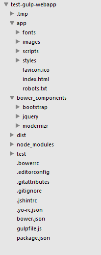
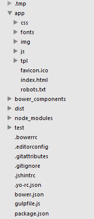
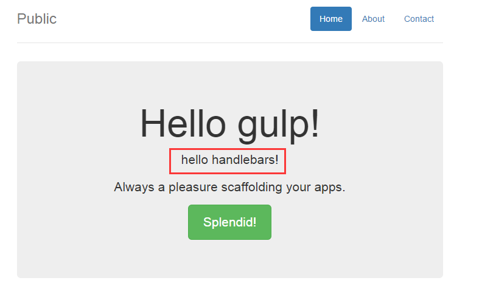
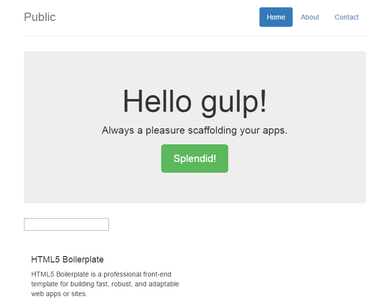

# FE-tool-template

自己攒了个前端开发模板，目的是提高前端开发效率，前后端分离

使用`gulp`作为自动化构建工具

`yeoman`生成项目文件代码结构

`bower`做包管理器

`handlebars`js模板引擎

添加php server环境，方便前端mock假数据

##准备工作##


###安装nodejs###

1. windows系统下安装nodejs及环境配置
	
   - 下载nodejs，官网[http://nodejs.org/download/](http://nodejs.org/download/)，选择适合你电脑配置的版本下载

   - 下载完成后双击无脑安装，装好后在cmd控制台输入：`node -v`，控制台打印出版本号，则安装成功。

   - npm安装  新版nodejs已经集成npm，在cmd控制台输入`npm -v`，打印出版本号，则安装成功。

   - 接下来便可以使用npm命令安装模块了
  
        安装：`npm install <module name>`

		全局安装：`npm install -g <Module Name>`

		卸载模块：`npm uninstall <Module Name>`

		显示当前目录下安装的模块：`npm list`

2. mac系统下安装nodejs

   - 下载nodejs，官网[http://nodejs.org/download/](http://nodejs.org/download/)，选择mac版本下载

   - 下载完成后，点击安装

顺便列两个常用命令行

`cd ` 定位到目录

`ls ` 列出文件列表 


###安装gulp###

`npm install -g gulp`

输入`gulp -v`，查看版本号确保正确安装

###安装yeoman###

yeoman：在web项目立项阶段用来生成项目的文件、代码结构，包括代码校验、测试和压缩等功能。

`npm install -g yo`

###安装bower###

bower：web的包管理器

`npm install -g bower`


##正式开始##

###将gulp安装到项目

`npm install --save-dev gulp`

这里使用`--save-dev`来更新package.json文件，更新devDependencies值，表明项目需要依赖gulp

###用gulp-webapp生成项目目录###

安装gulp-webapp

`npm install -g generator-gulp-webapp`

在项目目录下，输入命令行

`yo gulp-webapp 项目名`

安装时会提示是否安装sass，bootstrap和modernizr，除了sass，另外两个都选中安装。（项目主要用less，所以不安装sass）

此时项目下已生成项目目录

<figure>
	
</figure>

按照项目习惯，将app下的styles改为css，scripts改为js，images改为img，.tmp下的styles改为css。

修改后的目录如下：

<figure>
	
</figure>

此时别忘了修改`gulpfile.js`中的相应目录。最下面会给出最终的`gulpfile.js`文件内容。


目录说明：

- .tmp：临时目录
- app：开发的源代码目录
- bower_components：通过bower下载下来的包
- dist：生成用于发布的项目
- node_modules：nodejs依赖包
- test：测试文件的目录
- .bowerrc：bower属性
- .editorconfig：对开发工具的属性配置
- .gitattributes：git属性的配置
- .gitignore：git管理文件的配置
- .jshintrc：JSHint配置
- bower.json：bower依赖管理
- gulpfile.js：gulp开发过程管理
- package.json：项目依赖文件

app目录下的结构说明：

- css: 存放css文件
- font：存放字体资源
- img：存放图片资源
- js：存放js源文件
- templates（自己添加）：存放模板文件   后面会详细说明
- mock（自己添加）：存放模拟后台假数据的php  后面会详细说明


##添加php环境##

在gulp中添加php开发环境，方便前端mock假数据

使用gulp插件<a href="https://www.npmjs.com/package/gulp-connect-php" target="_blank">gulp-connect-php</a>

神器啊简直~~

注意：使用这个插件需要php在5.4.0以上

npm安装`gulp-connect-php`

```
$ npm install --save-dev gulp-connect-php
```

其实只添加上面的插件，再在gulpfile里配置好就已经有了php环境了，但会造成引用样式路径出错，导致加载不了css等文件

为了解决这个问题，需要gulp插件`http-proxy`，安装

```
$ npm install --save-dev http-proxy
```

综合上述两点，在`gulpfile`中添加如下内容：

```
var connect = require('gulp-connect-php');
var httpProxy = require('http-proxy');

gulp.task('php-serve', ['styles', 'fonts'], function () {
    connect.server({
        port: 9001,   //端口号可以自定义
        base: 'app/',
        open: false
    });

    var proxy = httpProxy.createProxyServer({});

    browserSync({
        notify: false,
        port  : 9000,
        server: {
            baseDir   : ['.tmp', 'app'],
            routes    : {
                '/bower_components': 'bower_components'
            },
            middleware: function (req, res, next) {     //给server添加一个middleware，可以观察在请求时是否需要代理
                var url = req.url;

                if (!url.match(/^\/(css|fonts|bower_components)\//)) {
                    proxy.web(req, res, { target: 'http://127.0.0.1:9001' });
                } else {
                    next();
                }
            }
        }
    });

    // watch for changes
    gulp.watch([
        'app/*.html',
        'app/mock/*.php',    //mock是自己建的文件夹，放置.php文件
        'app/js/**/*.js',
        'app/img/**/*',
        '.tmp/fonts/**/*'
    ]).on('change', reload);

    gulp.watch('app/css/**/*.css', ['styles']);
    gulp.watch('app/fonts/**/*', ['fonts']);
    gulp.watch('bower.json', ['wiredep', 'fonts']);
});
```

通过上面的折腾，运行`gulp php-serve`就可以开一个能运行php的server了~~

接下来添加smarty模板

从官网下载smarty，将文件夹拷贝至app下

在app下新建文件夹`templates`、`templates_c`、`configs`，其中`templates`存放模板文件，`configs`存放smarty配置文件

在`configs`里添加配置文件`smarty.config.php`，这样可以方便php引用

```
<?php
    //Smarty PHP configuration
     
    define('REAL_PATH', dirname(dirname(__FILE__)));
 
    require_once(REAL_PATH.'/smarty/libs/Smarty.class.php');

    $smarty=new Smarty();
 
    $smarty->setCacheDir(REAL_PATH.'\cache');
    $smarty->setConfigDir(REAL_PATH.'\configs');
    $smarty->setPluginsDir(REAL_PATH.'\plugins'); 
    $smarty->setTemplateDir(REAL_PATH.'\templates');
    $smarty->setCompileDir(REAL_PATH.'\templates_c');
 
    //添加Smarty自带的插件库
    $smarty->addPluginsDir(REAL_PATH.'\smarty\plugins');
 
    //检测Smarty目录结构配置是否有效
    // $smarty->testInstall();
?>
```

在app下新建`mock`文件夹，里面主要存放模拟后台php假数据的`.php`文件

比如新建一个`test.php`

```
<?php
require('../configs/smarty.config.php');

$smarty->left_delimiter="<%";
$smarty->right_delimiter="%>";

$smarty->assign("num", 100);

$smarty->display('test.tpl');
?>
```

那么在`test.tpl`中就可以通过`<%num%>`来获得从`test.php`传过去的数据

浏览器中`localhost:端口号/mock/test.php`，即可出现`test.tpl`的页面效果，同时含有动态数据。

##添加Handlebars作为JS模板引擎##

###安装依赖###

安装gulp插件

`npm install --save-dev gulp-handlebars gulp-define-module gulp-declare`

gulp-handlebars能够把`.hbs`模板预编译为JavaScript

gulp-define-module和gulp-declare结合使用，将编译好的JavaScript模板打包到一个命名空间模型中去。

用bower安装Handlerbars

`bower install --save handlebars`

这样可以把Handlebars runtime添加到页面中，编译过得模板正依赖于此。

###添加一个`templates`task###

在gulpfile.js里添加

```
gulp.task('templates', function () {
  return gulp.src('app/templates/**/*.hbs')
    .pipe($.handlebars())
    .pipe($.defineModule('plain'))
    .pipe($.declare({
      namespace: 'MyApp.templates' // change this to whatever you want
    }))
    .pipe(gulp.dest('.tmp/templates'));
});
```

这样就会将`.hbs`文件编译成`.js`文件，并存放到`.tmp`目录下

###在`html`和`serve`里均添加`templates`依赖###

```
gulp.task('html', ['styles', 'templates'], function () {
  ...
```

```
gulp.task('serve', ['styles', 'templates', 'fonts'], function () {
    ...
```

###编辑`serve`task###

在`serve`task里进行添加，使得`.hbs`文件的任何更改都会触发`templates`task，每当有一个`.js`文件在`.tmp/templates`生成，浏览器就会重新加载。


```diff
 gulp.task('serve', ['styles', 'templates', 'fonts'], function () {
   ...
   gulp.watch([
     'app/*.html',
     '.tmp/styles/**/*.css',
+    '.tmp/templates/**/*.js',
     'app/scripts/**/*.js',
     'app/images/**/*'
   ]).on('change', reload);

   gulp.watch('app/styles/**/*.scss', ['styles', reload]);
+  gulp.watch('app/templates/**/*.hbs', ['templates', reload]);
   gulp.watch('bower.json', ['wiredep', 'fonts', reload]);
 });
```

同样的，在task`php-serve`里也加上

```diff
 gulp.task('php-serve', ['styles', 'templates', 'fonts'], function () {
   ...
   gulp.watch([
     'app/*.html',
     'app/mock/*.php',
     '.tmp/styles/**/*.css',
+    '.tmp/templates/**/*.js',
     'app/scripts/**/*.js',
     'app/images/**/*'
   ]).on('change', reload);

   gulp.watch('app/styles/**/*.scss', ['styles', reload]);
+  gulp.watch('app/templates/**/*.hbs', ['templates', reload]);
   gulp.watch('bower.json', ['wiredep', 'fonts', reload]);
 });
```

###使用Handlebars###

在`app/templates`里写handlebars文件（`.hbs`文件），并在需要用到的HTML里像引用`.js`文件一样引用。

例子

在`app/templates`里写一个`foo.hbs`文件，内容如下

`<p>hello handlebars!</p>`

然后在需要引用该模板的页面加上：

```
<script src="bower_components/handlebars/handlebars.runtime.js"></script>
<script src="templates/foo.js"></script>
```

通过下列语句渲染模板

```
var tpl = MyApp.templates.foo(); //MyApp.templates作为命名空间，可以在templates task里更改成任意名称
$('#id').html(tpl);  //添加到你需要添加的地方
```

我的效果：

<figure>
	
</figure>

handlebars模板已被引用进来


##最终的`gulpfile.js`文件##

```
/*global -$ */
'use strict';
var gulp = require('gulp');
var $ = require('gulp-load-plugins')();
var browserSync = require('browser-sync');
var reload = browserSync.reload;
var connect = require('gulp-connect-php');
var httpProxy = require('http-proxy');

gulp.task('styles', function () {
  return gulp.src('app/css/main.css')
    .pipe($.sourcemaps.init())
    .pipe($.postcss([
      require('autoprefixer-core')({browsers: ['last 1 version']})
    ]))
    .pipe($.sourcemaps.write())
    .pipe(gulp.dest('.tmp/css'))
    .pipe(reload({stream: true}));
});

gulp.task('jshint', function () {
  return gulp.src('app/js/**/*.js')
    .pipe(reload({stream: true, once: true}))
    .pipe($.jshint())
    .pipe($.jshint.reporter('jshint-stylish'))
    .pipe($.if(!browserSync.active, $.jshint.reporter('fail')));
});

gulp.task('html', ['styles', 'templates'], function () {
  var assets = $.useref.assets({searchPath: ['.tmp', 'app', '.']});

  return gulp.src('app/*.html')
    .pipe(assets)
    .pipe($.if('*.js', $.uglify()))
    .pipe($.if('*.css', $.csso()))
    .pipe(assets.restore())
    .pipe($.useref())
    .pipe($.if('*.html', $.minifyHtml({conditionals: true, loose: true})))
    .pipe(gulp.dest('dist'));
});

gulp.task('images', function () {
  return gulp.src('app/img/**/*')
    .pipe($.cache($.imagemin({
      progressive: true,
      interlaced: true,
      // don't remove IDs from SVGs, they are often used
      // as hooks for embedding and styling
      svgoPlugins: [{cleanupIDs: false}]
    })))
    .pipe(gulp.dest('dist/img'));
});

gulp.task('fonts', function () {
  return gulp.src(require('main-bower-files')({
    filter: '**/*.{eot,svg,ttf,woff,woff2}'
  }).concat('app/fonts/**/*'))
    .pipe(gulp.dest('.tmp/fonts'))
    .pipe(gulp.dest('dist/fonts'));
});

gulp.task('extras', function () {
  return gulp.src([
    'app/*.*',
    '!app/*.html'
  ], {
    dot: true
  }).pipe(gulp.dest('dist'));
});

gulp.task('templates', function () {
  return gulp.src('app/templates/**/*.hbs')
    .pipe($.handlebars())
    .pipe($.defineModule('plain'))
    .pipe($.declare({
      namespace: 'MyApp.templates' // change this to whatever you want
    }))
    .pipe(gulp.dest('.tmp/templates'));
});

gulp.task('clean', require('del').bind(null, ['.tmp', 'dist']));

gulp.task('serve', ['styles', 'templates', 'fonts'], function () {
  browserSync({
    notify: false,
    port: 9000,
    server: {
      baseDir: ['.tmp', 'app'],
      routes: {
        '/bower_components': 'bower_components'
      }
    }
  });

  // watch for changes
  gulp.watch([
    'app/*.html',
    '.tmp/css/**/*.css',
    '.tmp/templates/**/*.js',
    'app/js/**/*.js',
    'app/img/**/*',
    '.tmp/fonts/**/*'
  ]).on('change', reload);

  gulp.watch('app/css/**/*.css', ['styles']);
  gulp.watch('app/templates/**/*.hbs', ['templates', reload]);
  gulp.watch('app/fonts/**/*', ['fonts']);
  gulp.watch('bower.json', ['wiredep', 'fonts']);
});

gulp.task('php-serve', ['styles', 'fonts'], function () {
    connect.server({
        port: 9001,
        base: 'app/',
        open: false
    });

    var proxy = httpProxy.createProxyServer({});

    browserSync({
        notify: false,
        port  : 9000,
        server: {
            baseDir   : ['.tmp', 'app'],
            routes    : {
                '/bower_components': 'bower_components'
            },
            middleware: function (req, res, next) {
                var url = req.url;

                if (!url.match(/^\/(css|fonts|bower_components)\//)) {
                    proxy.web(req, res, { target: 'http://127.0.0.1:9001' });
                } else {
                    next();
                }
            }
        }
    });

    // watch for changes
    gulp.watch([
        'app/*.html',
        'app/mock/*.php',
        '.tmp/css/**/*.css',
	'.tmp/templates/**/*.js',
        'app/js/**/*.js',
        'app/img/**/*',
        '.tmp/fonts/**/*'
    ]).on('change', reload);

    gulp.watch('app/css/**/*.css', ['styles']);
    gulp.watch('app/templates/**/*.hbs', ['templates', reload]);
    gulp.watch('app/fonts/**/*', ['fonts']);
    gulp.watch('bower.json', ['wiredep', 'fonts']);
});

// inject bower components
gulp.task('wiredep', function () {
  var wiredep = require('wiredep').stream;

  gulp.src('app/*.html')
    .pipe(wiredep({
      ignorePath: /^(\.\.\/)*\.\./
    }))
    .pipe(gulp.dest('app'));
});

gulp.task('build', ['jshint', 'html', 'images', 'fonts', 'extras'], function () {
  return gulp.src('dist/**/*').pipe($.size({title: 'build', gzip: true}));
});

gulp.task('default', ['clean'], function () {
  gulp.start('build');
});

```


##运行##

###输入命令行

`gulp serve`

浏览器会自动打开app下的index.html，localhost：9000

<figure>
	
</figure>

任何文件的改动都会自动刷新浏览器

###输入命令行

`gulp php-serve`

浏览器会自动打开app下的index.php，localhost：8090 (可在gulpfile.js修改端口号)

同样的，任何文件的改动都会自动刷新浏览器

##编译文件##

`gulp build`

gulp将build后的文件放入dist目录下

